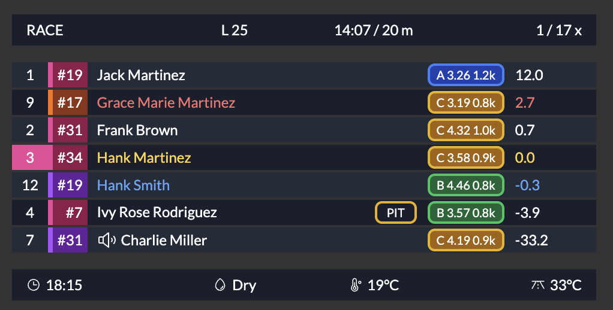

# iRacing Dashies

Welcome to the iRacing Dashies project! This repository contains the code and documentation for building iRacing overlays. 

This is an open-source project that aims to provide a platform to build overlays and utilities for iRacing using React and Electron. 

This is built with the intention of being easily approachable by developers who are familiar with web development as well as not needing to have a deep understanding of the iRacing SDK, C++, or even needing to run iRacing at all.

This project is still in the early stages of development, so there may be bugs and many missing features. If you are interested in contributing please reach out and we can discuss how we can collaborate.

## Table of Contents

- [Introduction](#introduction)
- [Installation](#installation)
- [Usage](#usage)
- [Contributing](#contributing)
- [License](#license)

## Introduction

This project is built with React and Electron and uses ths iRacing SDK via [irsdk-node](https://github.com/bengsfort/irsdk-node) library to retrieve data from the iRacing live telemetry memory-map.

## Installation

To install IRDashies, follow these steps:

1. Clone the repository
2. Navigate to the project directory
3. Install the required dependencies:
  ```bash
  npm install
  ```
4. Run the application:
  ```bash
  npm start
  ```

## Usage

To start using IRDashies, run the following command:
```bash
npm start
```
This will start the application.

Look for the application in your app tray. Right-click on the icon and Lock / Unlock to resize and move overlays around.

> You will need to have Node.js installed on your machine to run the application. You can download it from [here](https://nodejs.org/).

> On macOS you will see mocked data from a sample session. To connect to iRacing, you will need to run the application on Windows.

## Folder Structure

The project is structured as follows:

```
irdashies/
  ├── src/
  │   ├── app/
  │   ├── frontend/
  │   ├── types/
```

- `src/app/` contains the main Electron application code.
- `src/frontend/` contains the React components for the overlays.
- `src/types/` contains TypeScript type definitions shared between the frontend and backend (e.g. telemetry types).

> Note: Frontend components should NOT import anything from ./app as these are Electron-specific modules. Any communication should be done via IPC and types exposed via the types folder.

## Storybook

To view the components in Storybook, run the following command:
```bash
npm run storybook
```

This allows you to easily develop, test, and visualise the widgets/overlays in isolation.

## Package (create .exe)

To package the application and create the .exe, run the following command:
```bash
npm run package
```

To create the .exe and the installer run the following:

```bash
npm run make
```

## Developing on Mac

As you may know, the iRacing SDK is only available on Windows. To develop on Mac OS, there is a mock SDK that is loaded which generates some dummy data for you to work with. This is useful for developing the UI components and widgets.

## Available overlays

### Input trace

Displays the throttle, clutch, and brake input traces, as well as the current gear and speed.


### Standings

Displays standings information for the current session.


### Relative

Displays drive relative delta information for the current session.



## Contributing

We welcome contributions to the IRDashies project! If you have any ideas, suggestions, or bug reports, please open an issue or submit a pull request.

## License

This project is licensed under the MIT License. See the [LICENSE](LICENSE) file for more details.